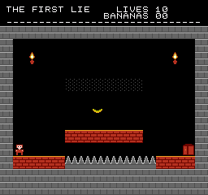

<!--
SPDX-License-Identifier: GPL-3.0-or-later
Copyright (C) 2026 Prodigy75000
-->

# FamiRust

A clean-room **Nintendo Entertainment System / Famicom** emulator core, written
from scratch in Rust: accuracy-first, with **byte-identical, platform-agnostic
save states** as a hard design constraint (for cross-engine netplay and
rollback). SuperRust (SNES) and UltraRust (N64) are sibling cores built for the
same netplay experiments.

It ships as a [libretro](https://www.libretro.com/) core and runs the commercial
NES library: hundreds of licensed titles boot and play.

## Design goals, in priority order

1. **Correctness / accuracy.** A cycle-stepped Ricoh 2A03 CPU (an NMOS 6502 with
   decimal mode fused off) interleaved three-dots-per-cycle with a dot-accurate
   2C02 PPU and the 2A03 APU. The CPU passes the full
   [TomHarte / SingleStepTests](https://github.com/SingleStepTests/65x02) 6502
   corpus (all 256 opcodes, 10 000 vectors each, per-cycle bus trace), including
   every unofficial opcode, before it is allowed to drive anything else.
2. **Byte-identical, deterministic save states**, a requirement, not a feature.
   Cross-engine netplay and rollback are only sound when two machines in the same
   logical state serialize to the *same bytes* on every platform/ABI/compiler.
   See [`crates/nes-core/src/save.rs`](crates/nes-core/src/save.rs): every mutable
   field is serialized little-endian in a fixed order; no `usize`, pointer, float,
   or hash-ordering ever enters a state; load is the strict inverse and *refuses*
   truncated, malformed, or over-long buffers. A state made on the Android `.so`
   loads on the Windows `.dll`/macOS `.dylib` and vice-versa.
3. **Clean-room.** Built from hardware documentation only (the NESdev wiki
   reference pages, distilled into [`docs/notes/`](docs/notes/)). No third-party
   emulator source was consulted. Measured reference *data* (e.g. the 2C02
   master palette) is used as data, and cited where it is.

## What works

- **CPU**: cycle-accurate 2A03; full TomHarte pass incl. all illegal opcodes + JAM.
- **PPU**: dot-accurate 2C02: loopy v/t/x/w scrolling, background + sprite
  pipelines, sprite-0 hit, 8-sprite-per-line evaluation/overflow, the `$2002`
  read/NMI races, and mid-frame raster splits (sprite-0 status bars, scroll
  splits), the tricky timing that games like *Bart vs. the Space Mutants* rely on.
- **APU**: all five channels (2 pulse, triangle, noise, DMC) with DMC DMA
  CPU stall; audio resampled for the host.
- **Mappers**: 0 (NROM), 1 (MMC1), 2 (UxROM), 3 (CNROM), 4 (MMC3), 5 (MMC5,
  incl. extended-attribute mode), 7 (AxROM), 9 (MMC2), 11 (Color Dreams),
  13 (CPROM), 34 (BNROM/NINA-001), 64 (RAMBO-1), 65 (Irem H3001), 66 (GxROM),
  69 (Sunsoft FME-7), 71 (Camerica), 79 (NINA-03), 113 (NINA-113),
  118 (TxSROM), 119 (TQROM), 232 (Camerica BF9096).
- **Famicom Disk System**: the RAM adapter (mapper 20) driven by the real BIOS
  (`disksys.rom`, user-supplied): disk-image parsing, the byte-level drive with
  gap/mark framing, timer + transfer IRQs, disk reads *and writes* (in-game
  saves), the RP2C33 wavetable + modulation expansion sound channel, and the
  libretro disk-control interface for side/disk swapping.
- **Headers**: iNES + NES 2.0 parsing, with a CRC32 correction DB for known-bad
  dumps (e.g. "DiskDude!"-corrupted headers).
- **RetroAchievements**: exposes system RAM + cartridge work RAM over the
  libretro memory interface.
- **Save states**: see goal #2; validated byte-identical across platforms.

## Layout

```
crates/
  nes-core/       the emulator core (lib crate: nes_core)
  nes-libretro/   libretro C ABI cdylib -> libnescore_libretro.{so,dll,dylib}
  nes-runner/     dev harnesses: `tomharte` (CPU conformance), `nes` (headless
                  render + audio dump), `play` (scripted input, for driving
                  something playable), `fingerprint` (save-state parity check)
  nes-asm/        a small dependency-free 6502 assembler, used to build the carts
roms/
  famirust-demo/  the demo cartridge: source, art, and the built .nes (CC0)
  monkey-farce/     MONKEY FARCE, a one-screen platformer (CC0)
docs/notes/       clean-room hardware reference notes
dumps/            cart images (gitignored, bring your own)
tests/vendor/     vendored TomHarte 6502 vectors (gitignored)
```

This is a standalone Cargo workspace.

## Build & run

```sh
cargo build --release            # builds the core, libretro cdylib, and harnesses
cargo test                       # unit tests (core, save-state golden, PPU timing)

# headless: render N frames of a ROM to a PNG (+ WAV of the audio)
cargo run --release -p nes-runner --bin nes -- path/to/game.nes 300 out.png

# the shipped libretro core:
#   target/release/libnescore_libretro.so   (Linux/Android)
#   target/release/nescore_libretro.dll     (Windows)
#   target/release/libnescore_libretro.dylib (macOS)
```

The three clients each take the core as a different artifact, and because save
states are versioned they want rebuilding together:

```sh
scripts/deploy-android-debug.sh   # arm64 .so -> TrophyHubAndroid jniLibs (+ APK)
cargo build --release -p nes-libretro
#   -> target/release/nescore_libretro.dll, for TrophyHubDesktop
scripts/build-ios-dylib.sh both   # macOS only: dylib -> TrophyHubIOS iosApp/cores
```

**Android (arm64)** with the NDK, 16 KB-page-aligned (required by Google Play for
apps targeting API 35+):

```sh
export CARGO_TARGET_AARCH64_LINUX_ANDROID_LINKER=<ndk>/.../aarch64-linux-android21-clang
RUSTFLAGS="-C link-arg=-Wl,-z,max-page-size=16384" \
  cargo build --release -p nes-libretro --target aarch64-linux-android
```

**macOS**, native build:

```sh
cargo build --release -p nes-libretro
# -> target/release/libnescore_libretro.dylib
```

Universal (Intel + Apple Silicon) binary:

```sh
rustup target add x86_64-apple-darwin aarch64-apple-darwin
cargo build --release -p nes-libretro --target x86_64-apple-darwin
cargo build --release -p nes-libretro --target aarch64-apple-darwin
lipo -create -output libnescore_libretro.dylib \
  target/x86_64-apple-darwin/release/libnescore_libretro.dylib \
  target/aarch64-apple-darwin/release/libnescore_libretro.dylib
```

> **On 16 KB pages / macOS:** the `max-page-size=16384` flag above is an *Android*
> requirement. macOS needs no equivalent: Apple Silicon uses 16 KB pages
> natively and Apple's linker (`ld64`) already aligns Mach-O segments to the
> target page size by default, so the plain `cargo build` above is correctly
> aligned for both arm64 (16 KB) and x86_64 (4 KB) Macs.

Nothing here includes or requires copyrighted ROMs or BIOS images; supply your
own legally obtained dumps. The one cartridge that does ship with this
repository is our own, and is described below.

## The demo cartridge

[`roms/famirust-demo/`](roms/famirust-demo/) holds **FamiRust Demo Cart**, an NES
cartridge written from scratch for this project and **dedicated to the public
domain under CC0 1.0**. Every byte of it is original: the 6502 source, the font,
the graphics, the music, and the assembler that builds it.

It is not a game. It is five screens that each put one part of the machine under
load: 64 sprites and the eight-per-scanline limit, a sprite-0 raster split over a
two-nametable scroll, the 2C02 master palette, all five APU channels including a
DPCM sample, and a live two-port controller readout.

```sh
scripts/build-demo-rom.sh          # rebuild it, and re-hash it
cargo test -p nes-asm --test demo_rom_reproduces   # committed .nes == committed source
cargo test -p nes-core --test demo_cart            # it boots, scrolls, and round-trips a save state
```

Because it carries no third-party rights, it can be redistributed, bundled into a
commercial application, or handed to anyone who needs a working cartridge to test
an emulator with. See [`roms/famirust-demo/README.md`](roms/famirust-demo/README.md)
and the statement of permission beside it.

It doubles as a fixture the core is tested against: `crates/nes-core/tests/demo_cart.rs`
needs no ROM the user has to supply, so it runs on a fresh clone on any machine.

## MONKEY FARCE

[`roms/monkey-farce/`](roms/monkey-farce/) holds a second original cartridge, also
**CC0 1.0**, and this one is a game: a one-screen platformer in which some of the
floor is not the floor. The blocks that hold you up and the blocks that do not
are drawn from the same tiles out of the same palette, so there is nothing to
spot. Six rooms, sixteen bananas, ten lives for the lot.



A room is typed out as sixteen-by-thirteen ASCII in the source and the traps
configure themselves from the drawing: a saw finds its patrol by looking along
its own row, a shooter takes its firing phase from where it sits. The tune is
written as notes for the same reason, and a four-voice player mixes it against
the sound effects by ducking rather than mixing.

There is a solver, `tools/reach.py`, that ports the physics out of the assembly
and proves every room can be finished and every banana taken. Four of the six
rooms in the first draft could not be finished and all four looked fine; three
later had prizes nobody could reach.

```sh
scripts/build-monkey-farce.sh                        # regenerate, check, rebuild, test
cargo test -p nes-core --test monkey_farce           # it plays, and the liar is invisible
python roms/monkey-farce/tools/reach.py              # every room is still finishable
```

As a core fixture it exercises considerably more of the machine than a menu
does: sixty-odd sprites, per-block attribute palettes, mid-frame palette writes,
a vertical-blank write queue, all five APU channels driven every frame, and a
save state taken in the middle of a jump.

## License

GPL-3.0-or-later. See [LICENSE](LICENSE).

The two cartridges in `roms/` are the exception: `famirust-demo` and
`monkey-farce` are both CC0 1.0, so that the artifacts meant to be passed around
freely have nothing attached to them. Each carries its own `LICENSE` and a
signed statement of permission.

"Nintendo Entertainment System", "Famicom", and "NES" are trademarks of Nintendo.
FamiRust is an independent, clean-room reimplementation and is not affiliated with
or endorsed by Nintendo.
