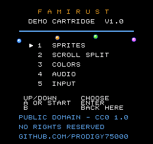
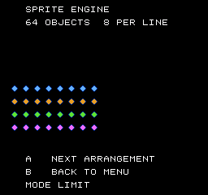
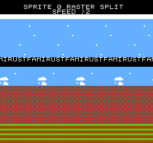
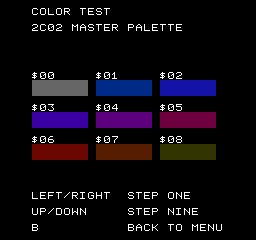
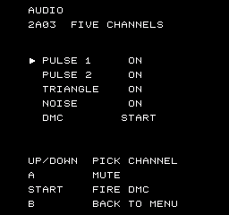
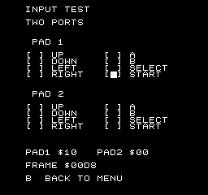

<!--
SPDX-License-Identifier: CC0-1.0
FamiRust Demo Cart. Dedicated to the public domain; see LICENSE.
-->

# FamiRust Demo Cart

A freely distributable NES cartridge, written from scratch for this project, for
anyone who needs a ROM they are allowed to ship.

**[`famirust-demo.nes`](famirust-demo.nes)**: 40,976 bytes, mapper 0 (NROM),
32 KB PRG, 8 KB CHR, vertical mirroring. Runs on real hardware and on any
emulator.

It is not a game. It is five screens, each of which puts one part of the machine
under load so that a person looking at the screen can tell whether the emulator
got it right.

## Why it exists

Every emulator needs a test ROM, and almost every test ROM in circulation is
either a commercial game nobody can legally redistribute or a homebrew of
uncertain provenance. That is fine on your own desk and a problem the moment you
have to hand someone a working demonstration: a reviewer, a store, a colleague.

So this cartridge is the answer to "show me it works, with something you are
allowed to give me." It is original work, dedicated to the public domain under
[CC0 1.0](LICENSE), with a signed [statement of permission](PERMISSION.md) and a
build that anyone can reproduce byte for byte from the source in this directory.

Use it for anything. No attribution required, no permission to ask for.

## The screens

Up and Down choose, A or Start enters, B goes back to the menu.

| | |
|---|---|
|  | **Menu.** Four sprites idle under the rule, so you can tell at a glance that sprite rendering is alive before you pick anything. |
|  | **1 Sprites.** 64 objects. `A` cycles four arrangements: two counter-rotating rings, a grid of sixteen-per-row, the same grid with rotating OAM priority, and a full-width sine wave. The grid is the interesting one. The hardware draws eight sprites per scanline and drops the rest, so exactly half of each row should vanish. If sixteen render, the sprite evaluation is wrong. |
|  | **2 Scroll Split.** A status bar held still over a playfield scrolling across both nametables, using a mid-frame sprite-0 hit. The sprite that drives it is one scanline tall and hidden against the white bar. Left and Right change speed, including reverse. If the split leaks, the bar scrolls with the playfield or the seam lands on the wrong line. |
|  | **3 Colors.** Nine swatches straight out of the 2C02 master palette, each labelled with its index. Left and Right step by one, Up and Down by nine, and the whole 64-entry palette is reachable. The palette writes go through the vertical-blank queue, so this also exercises mid-frame palette RAM updates. |
|  | **4 Audio.** All five channels. A 32-step original pattern plays on the two pulse channels, the triangle and the noise channel; Up and Down pick a channel and `A` mutes it, so each can be heard alone. Start fires a DPCM sample, which is the only thing here that makes the CPU stall for DMA. |
|  | **5 Input.** Both controller ports, live, with the raw port byte in hex and a frame counter. The pads are read with the standard double-read-until-they-agree, which is what keeps a controller read honest while DMC DMA is stealing cycles. |

## Building it

Nothing outside this repository is needed. No cc65, no NESASM, no Python for the
build itself.

```sh
cargo run -p nes-asm -- roms/famirust-demo/src/main.s \
    -o roms/famirust-demo/famirust-demo.nes -s
```

or, from the repository root:

```sh
scripts/build-demo-rom.sh          # assembles, then rewrites SHA256SUMS
```

`-s` writes a `.sym` listing beside the ROM, which is what you want when reading
a core trace back against the source.

The committed `.nes` is checked against the committed source on every
`cargo test`:

```
cargo test -p nes-asm --test demo_rom_reproduces
```

That is the whole reproducibility claim, and it fails loudly if a single byte
drifts.

## Layout

```
src/main.s      code: reset, NMI, the frame loop, and the five scenes
src/data.s      screens, palettes, attribute tables, music patterns
src/chr.s       the character ROM, drawn as text art (see below)
src/tables.s    generated trigonometry and NTSC timer periods
tools/genchr.py    regenerates src/chr.s from the glyph set it contains
tools/gentables.py regenerates src/tables.s
screenshots/    the images above, rendered by the headless harness
```

The character ROM is written as pixels, not as hex. A tile looks like this:

```
.tile chr_glyph_A
..11....
.1..1...
1....1..
111111..
1....1..
1....1..
1....1..
........
.endtile
```

`.` is the transparent or background colour and `1` `2` `3` are the three
drawable colours of whichever palette the tile is rendered with. The assembler
turns each block into the 2C02's two-bitplane pattern format. Every glyph and
every graphic in this cartridge is visible in `src/chr.s` as the picture it is,
which is the point: you can see for yourself that none of it came from anywhere
else.

The font is laid out so that a tile index is exactly its ASCII code minus `$20`,
which is why the source can write screen text as text.

The two `tools/` scripts exist only so that a glyph can be edited as a compact
block and still come out with every row exactly eight pixels wide. Their output
is checked in and is perfectly readable on its own; you never need to run them
to build the ROM.

## The two toolchain pieces

`nes-asm` (in `crates/nes-asm/`) is a small two-pass 6502 assembler written for
this cartridge. It has no dependencies at all, which is deliberate: the chain
from source to `.nes` is entirely inside this repository, so the binary being
distributed carries no third-party licensing question anywhere in its path.

It assembles the 151 documented opcodes and refuses the unofficial ones. The
core emulates those and is graded on them by the TomHarte corpus, but a ROM
meant to be handed to someone else has no business relying on them.

Beyond the usual directives it has two worth knowing about:

- `.tile` / `.endtile`, the text-art block above.
- `.assert <expr>, "message"`, evaluated once every label is final. The cartridge
  uses it to pin its own layout: that the DPCM sample really did land on a
  64-byte boundary, that the scrolling banner still tiles a 32-column nametable
  exactly, that no tile got inserted into the middle of the font and quietly
  shifted every graphic constant after it.

## Licence

CC0 1.0 Universal. See [`LICENSE`](LICENSE) for the dedication and
[`PERMISSION.md`](PERMISSION.md) for a plain-language statement of authorship and
permission.

Note that the demo cart is CC0 while the emulator core around it is GPL-3.0. That
is on purpose. The core's licence is a choice about the emulator; the cart's job
is to be a thing nobody has to think about before shipping it.

"Nintendo Entertainment System" and "Famicom" are trademarks of Nintendo.
FamiRust is an independent, clean-room reimplementation and is not affiliated
with or endorsed by Nintendo.
