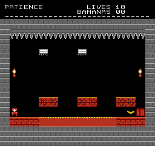
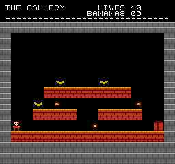
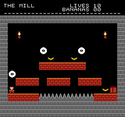
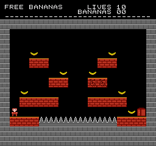
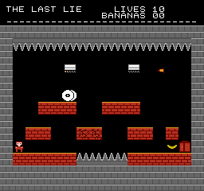

<!--
SPDX-License-Identifier: CC0-1.0
MONKEY FARCE. Dedicated to the public domain; see LICENSE.
-->

# MONKEY FARCE

A one-screen platformer for the NES, in which some of the floor is not the
floor.

**[`monkey-farce.nes`](monkey-farce.nes)**: 40,976 bytes, mapper 0 (NROM), 32 KB
PRG, 8 KB CHR, vertical mirroring. Runs on real hardware and on any emulator.


Six rooms, a door out of each, sixteen bananas on the way, and ten lives for the
whole keep. Between you and any of it, blocks that hold you up and blocks that
do not, drawn with the same tiles out of the same palette. There is nothing to
spot. You find out by standing on one.

Dedicated to the public domain under [CC0 1.0](LICENSE), with a signed
[statement of permission](PERMISSION.md) and a build anyone can reproduce byte
for byte from the source in this directory.

## The one thing it is honest about

The controls are generous, deliberately. There is coyote time on every ledge, a
jump buffer on every landing, a collision box narrower than the monkey, hazard
boxes smaller than the things that own them, and a death that costs you about
three quarters of a second. A game that lies to you about the level has no
business also lying to you about whether you pressed the button. The room is the
enemy. The pad is not.

The other thing it is honest about is that every room can be finished and every
banana can be taken, which is checked rather than believed. See `tools/reach.py`
below.

| | |
|---|---|
|  | **2. Patience.** Nothing in this room is hidden. The cracked floor is visibly cracked and gives you about a third of a second; the crusher shudders before it commits. It kills people anyway, because a fair amount of warning turns out to be shorter than it feels. |
|  | **3. The Gallery.** The walls shoot. Which wall block is a shooter is not marked, and each one takes its firing phase from where it sits in the grid, so they never fall into one safe rhythm. The wall you spawn against does not shoot; that is a rule the build enforces. |
|  | **4. The Mill.** A saw works out its own patrol by looking left and right along its row until it finds something solid. Draw it a longer corridor and it patrols a longer corridor. Which way it sets off comes from the column it was drawn in, so a room full of them gets saws that cross instead of saws in convoy. |
|  | **5. Free Bananas.** Seven of them up four tiers, laid out like a reward for exploring. Most are over something. |
|  | **6. The Last Lie.** The door is visible from the start and the floor runs all the way to it. |

A door is not a tripwire: you stand in it and press **UP**. That costs one button
and buys the rooms the right to put a door somewhere you would otherwise run
straight through by accident, which room 6 does.

## A room is a picture

This is the whole level format:

```
room_1:
  .str "THE FIRST LIE "
  .str "################"
  .str "#..............#"
  .str "#.*..........*.#"
  .str "#..............#"
  .str "#....%%%%%%....#"
  .str "#..............#"
  .str "#......B.......#"
  .str "#..............#"
  .str "#....==~~==....#"
  .str "#S............D#"
  .str "#====^^^^^^^===#"
  .str "################"
  .str "################"
```

Fourteen characters of name, then thirteen rows of sixteen. `=` is a platform
and `~` is a platform that is not there. `S` is where you start, `D` is the door
out, `^` is spikes, `c` is a cracked floor, `B` is a banana, `W` is a saw, `C` is
a crusher, `>` and `<` are wall blocks that shoot.

Nothing is packed, indexed or compiled by hand. The assembler's `.str`
directive already emits ASCII minus $20, which is exactly an index into a
96-byte lookup table, so a room is edited by editing the picture of it. That
was the point: authoring has to be fast enough that you can afford to throw
rooms away, because most of the ones you write are not any good and you only
find out by playing them.

Two consequences worth naming:

- **The traps configure themselves from the drawing.** A saw finds its patrol
  by looking along its own row. A crusher falls until something stops it. A
  shooter's phase comes from its position. There are no parameters to tune and
  none to forget.
- **A mistyped row fails the build.** An assertion under each room checks its
  size, so a row typed one character short cannot slide every later row along
  by one and quietly produce a different room from the one that was drawn.

## The premise is checked three times

The liar and the honest platform have to be indistinguishable. That is the sort
of claim that rots the first time somebody adjusts the art, so it is defended
where the player cannot defend it:

1. **In the art generator.** The liar does not imitate the honest platform, it
   is issued the same tile numbers, because the tile pool shares identical 8x8s.
   `tools/genart.py` compares the two and refuses to write anything if they have
   come apart.
2. **In the ROM.** `main.s` asserts that the two share a palette, that one is
   solid and the other is not, and that the tiles still match.
3. **On the screen.** `crates/nes-core/tests/monkey_farce.rs` boots the
   cartridge, reads the two blocks out of the frame the PPU produced, and
   compares them pixel for pixel.

Giving the liar a single different pixel trips all three.

## Can you actually finish it?

```sh
python roms/monkey-farce/tools/reach.py        # every room
python roms/monkey-farce/tools/reach.py 4      # just that one
SHOW=1 python roms/monkey-farce/tools/reach.py # print the maps too
```

This reads `rooms.s`, reads the physics constants back out of `main.s`, and
searches. From every block you can stand on it simulates real jumps frame by
frame, with the same constants, the same collision box and the same order of
operations as the 6502, and asks which blocks you can be standing on next.

It exists because four of the six rooms in the first draft were impossible and
all four looked fine. The jump clears exactly two blocks of height, and a
platform one row too high is indistinguishable on paper from one placed
correctly right up until nobody can finish the level. When a room fails, the
tool prints it with the reachable cells marked, so you can see where the floor
ran out.

It checks the bananas too, and at a higher bar than the door: not merely "could
the box ever overlap it" but "can you stand in its cell, or directly under it".
The looser test passes for a banana that needs a maximum-height jump from one
exact spot, and in the hand that is indistinguishable from impossible. And it
times the first dart from every shooter to the spawn, because a `>` drawn beside
the `S` looks adjacent in the picture and is an execution on the screen.

It does not model saws, crushers or darts in flight. Those decide whether a room
is hard. This answers the different and more important question of whether it is
possible, which is a property of the walls alone.

## Three rules that cost a playtest each

**Platforms go two rows apart, never three.** Standing on a block puts you in
the row above it and the jump clears 36 pixels, so row 8 to row 6 works and row
8 to row 5 does not. Four of the six rooms in the first draft broke this.

**A shooter goes in the row the player occupies**, not the row of the floor
they stand on. Its dart leaves at its own height, so a `>` drawn one row too
high sails over everybody's head and the room becomes a corridor with
decorative gunfire in it.

**Nothing shoots along the row you spawn in, from the side you spawn on.**
`reach.py` measures how long the first dart takes to arrive and fails the room
under three quarters of a second.

## The music

D harmonic minor, 150 BPM, sixteen bars on a loop, written as notes in
`tools/genmusic.py` rather than as period values, because nobody has ever
spotted a wrong note in a wall of period values.

```
   pulse 1   the hook, mostly eighths: stated, answered, walked back down
   pulse 2   a sixteenth-note arpeggio of whatever chord is underneath it
   triangle  root and octave on eighths, the pumping bass
   noise     kick, snare, hats
```

The song is exactly 256 rows long on purpose: a byte counter wraps there, so
looping it costs an INX and nothing else.

Sound effects live on pulse 1 and the noise channel, which are the two the tune
can spare. Rather than mixing, each voice asks whether its channel is free and
simply does not play if it is not, so a jump ducks the hook for a fifth of a
second while the bass and the arpeggio carry on underneath. A note lost that way
is not recovered; the next row brings another one.

The generator checks its own arithmetic: A4 has to come back out of the table at
440 Hz, and every period in both tables has to land inside the eleven bits the
hardware has for it.

**One value worth knowing about.** The sweep registers get `$7F`, not the
customary `$08`. Both mean "leave this channel's pitch alone", but on pulse 1
`$08` asks for a target period of -1, which an emulator computing in unsigned
arithmetic mistakes for `$FFFF` and mutes on. This cartridge shipped twice with
a silent pulse 1 before that was understood. `$7F` asks for something positive
for every period, so there is nothing left for anyone to get wrong.

## Building it

Nothing outside this repository is needed.

```sh
scripts/build-monkey-farce.sh
```

which regenerates the art and the tune, checks every room is finishable,
assembles, rewrites `SHA256SUMS`, and runs both test suites. Or directly:

```sh
cargo run -p nes-asm -- roms/monkey-farce/src/main.s \
    -o roms/monkey-farce/monkey-farce.nes -s
```

The committed `.nes` is checked against the committed source on every
`cargo test`:

```
cargo test -p nes-asm --test monkey_farce_reproduces
```

To play it headlessly while working on it, `nes-runner`'s scripted-input
harness takes the frames as part of the script, which the button-pulsing one
cannot:

```sh
cargo run -p nes-runner --bin play -- roms/monkey-farce/monkey-farce.nes \
    "40=start;60=right;92=right+a;104=right;135#landed" out
```

`TRACE=1` adds a per-frame energy readout beside the WAV, which is how the
silent pulse channel was finally pinned down: an effect that never fires and an
effect that fires inaudibly sound identical from the far side of a speaker and
are not the same bug.

## Layout

```
src/main.s       the engine: reset, NMI, physics, collision, traps, music
src/rooms.s      the six rooms, typed out
src/data.s       palettes, the screens, the sound effect table
src/chr.s        the character ROM, drawn as text art        (generated)
src/artmap.s     tile numbers, block flags, the room alphabet (generated)
src/music.s      note tables and the song                     (generated)
tools/genart.py    rewrites chr.s and artmap.s from the art in it
tools/genmusic.py  rewrites music.s from the notes in it
tools/reach.py     proves every room can be finished
screenshots/     the images above, rendered by the headless harness
```

`chr.s` and `artmap.s` are generated together, from one run, so the tile numbers
the code uses cannot drift from the tiles the ROM actually holds. All three
generated files are checked in and readable on their own; you never need to run
a generator to build the ROM.

The art is written as pixels, not as hex:

```
.tile bgt_plat_0
33333333
22222222
22212222
22212222
11111111
22222221
22222221
22222221
.endtile
```

`.` is colour 0 and `1` `2` `3` are the three drawable colours of whichever
palette the tile is rendered with. Every graphic in this cartridge is visible in
`src/chr.s` as the picture it is, which is the point: you can see for yourself
that none of it came from anywhere else.

## Licence

CC0 1.0 Universal. See [`LICENSE`](LICENSE) for the dedication and
[`PERMISSION.md`](PERMISSION.md) for a plain-language statement of authorship
and permission. Use it for anything. No attribution required, no permission to
ask for.

The emulator core around it is GPL-3.0. That is on purpose: the core's licence
is a choice about the emulator, and this cartridge's job is to be a thing nobody
has to think about before shipping it.

"Nintendo Entertainment System" and "Famicom" are trademarks of Nintendo.
FamiRust is an independent, clean-room reimplementation and is not affiliated
with or endorsed by Nintendo.
