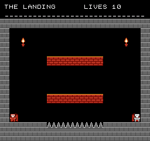

<!--
SPDX-License-Identifier: CC0-1.0
NOISY NEIGHBORS. Dedicated to the public domain; see LICENSE.
-->

# NOISY NEIGHBORS

A two-player escape for the NES. You are both locked in the same building on
the same bad night, and a room is not finished until **both** of you are
standing in a way out.



**[`noisy-neighbors.nes`](noisy-neighbors.nes)**: 40,976 bytes, mapper 0
(NROM), 32 KB PRG, 8 KB CHR, vertical mirroring. Runs on real hardware and on
any emulator.

## Status: v0.1, a foundation and not yet a game

This is honest rather than modest. What exists is the engine underneath the
game and one shakedown room to prove it, and the list below is what is missing.
Do not read the rest of this file as a description of something you can play.

**Done.** Two players on two pads, each with their own physics and their own
spawn. Two ways out, and a room that only ends when both of them are in one.
One of them dying taking the room away from both. All of it proven on the
machine rather than asserted here, and proven again under four frames of
lockstep netplay delay.

**Not done.** The noise bar and the neighbor it summons, which is the actual
game. The two of them being different from each other, which is the other
actual game: right now they are the same character in two colours. Carryable
crates, vents, held plates, the closet. Its own art and its own tune, both of
which are currently borrowed from MONKEY FARCE next door. `tools/reach2.py`,
the two-body solver.

**And therefore: no `PERMISSION.md` in this directory yet, deliberately.** The
statement of authorship in the other carts says that everything in them was
made for them, and today that is not true here, because the art and the music
came from the cartridge next door. Both are the same author's CC0 work, so
nothing is wrong with distributing this; the statement would simply say
something inaccurate, and it is signed in a real person's name. It gets written
when the cartridge has its own graphics and its own tune.

## The one rule

One of you reaching a door is worth nothing. The room ends when both of you are
standing in one and both of you have asked to leave.

That sentence is the cartridge, and it is not left as a sentence. `room_verdict`
in `main.s` is where it lives, and
`crates/nes-core/tests/noisy_neighbors.rs` boots the ROM, walks two players to
two different doors, has one of them ask to leave, and fails if anything at all
happens. Making the room end on a single player flips that test, which is how
we know the test is worth having.

## Two things it will not do

**Nothing asks the two of you to act on the same frame.** Every gate that wants
both of you will open wide and stay open. This is meant to be played over a
lockstep netplay link, which delays every input by four frames on both seats,
and a window measured in single frames is exactly what cannot survive that. A
window of twenty frames survives it with room to spare, because human
coordination error on "press it together" is already several times larger than
the delay.

This is a claim, so it is measured. The scripted harness runs any script under
the real delay:

```sh
cargo run -p nes-runner --bin play -- roms/noisy-neighbors/noisy-neighbors.nes \
    "30=start;40=/;61=left/right;160=/;171=up/;201=up/up;300?mode=M_END" out --delay 4
```

A run that finishes at `--delay 0` and still finishes at `--delay 4` contains
no input that had to land on an exact frame. The same check runs as a test.

**Nothing is decided by who moves first.** A room one of you can lose for the
other by being early is a room two strangers cannot play.

## Two of them, one set of variables

The hero physics came over from MONKEY FARCE unchanged, which was the point of
forking rather than rewriting: those routines had already been playtested into
shape. So there is one working hero in zero page and not two, and the player
being updated is swapped into it and back out again around his update.

The alternative was to index every hero variable by player, which means holding
X as a player number all the way through the physics and the collision code,
and those routines already use X and Y as scratch. Sixteen bytes in and sixteen
out, twice a frame, is sixty-four byte moves a frame. That is nothing, set
against rewriting the one part of the cartridge that was known to be right.

Everything from `hero_input` down to `ground_probe` therefore has no idea there
is another player at all. `tick_play` loops, `pick_pad` hands the working set
whichever pad belongs to it, and only `room_verdict` is ever told there are two.

## A room is a picture

Same format as next door, and the same reason: authoring has to be fast enough
that you can afford to throw rooms away.

```
room_1:
  .str "THE LANDING   "
  .str "################"
  .str "#..............#"
  .str "#.*..........*.#"
  .str "#..............#"
  .str "#....======....#"
  .str "#..............#"
  .str "#..............#"
  .str "#..............#"
  .str "#....======....#"
  .str "#..............#"
  .str "#D.1........2.D#"
  .str "#####^^^^^^#####"
  .str "################"
```

Fourteen characters of name, then thirteen rows of sixteen. `1` is where the
big one starts and `2` is where the small one starts, which is the only
addition to the alphabet so far. A mistyped row fails the build.

## Building it

```sh
scripts/build-noisy-neighbors.sh
```

which regenerates the art and the tune, assembles, rewrites `SHA256SUMS`, and
runs both test suites. The committed `.nes` is checked against the committed
source on every `cargo test`.

## Licence

CC0 1.0 Universal. See [`LICENSE`](LICENSE). Use it for anything.

"Nintendo Entertainment System" and "Famicom" are trademarks of Nintendo.
FamiRust is an independent, clean-room reimplementation and is not affiliated
with or endorsed by Nintendo.
